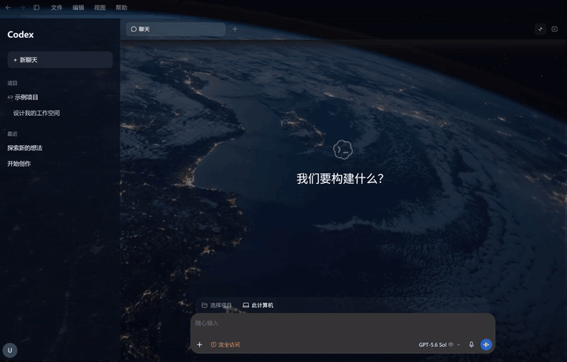

# Codex Dynamic Skin

[English](README.en.md) · **中文**

为 Windows 版 Codex 桌面客户端添加图片或动态视频背景，保留聊天区的可读性。基于 [Codex Dream Skin](https://github.com/Fei-Away/Codex-Dream-Skin) v1.5.18 开发的社区项目，**非 OpenAI 官方产品，与 OpenAI 无隶属关系**。

[观看高清 MP4 演示（约 8 秒）](docs/media/earth-demo.mp4) · [获取演示中的地球背景](docs/earth-background.md)

演示录自真实 Codex 窗口，仅展示应用区域；录制时临时匿名化了侧栏账号信息。内嵌 GIF 约 16 秒、7.7 MB，并对循环首尾做了平滑过渡。演示中的地球原视频不随项目或安装包分发。

查看静态预览

## 安装

当前版本 **0.1.1** 面向 **Windows x64**，需要已安装官方 Microsoft Store **OpenAI.Codex** 包。其他来源的客户端、macOS、Linux 和 ARM64 不在本版本支持范围内。

1. 从 [Releases](https://github.com/JiPaiFan1109/Codex-Dynamic-Skin/releases) 下载 `Codex-Dynamic-Skin-0.1.1-windows-x64.zip`，不要下载 GitHub 自动生成的源码 ZIP 代替安装包。
2. 将 ZIP **完整解压**到普通本地文件夹，再双击 `Install.cmd`。
3. 通过桌面 **Codex** 快捷方式启动。已有同名快捷方式时会保留原快捷方式，新入口命名为 **Codex Dynamic Skin**。
4. 打开桌面 **Codex Background Manager**，选择图片或视频并应用。涉及重启时按提示操作，先保存当前工作。

Release ZIP 自带固定版本 **Node.js 24.19.0 x64** 及其许可证，无需手动安装 Node.js 或运行 npm。构建和安装会校验 Node 可执行文件的 SHA-256 与 OpenJS Foundation Authenticode 签名；这不代表本项目脚本获得了 OpenAI 或 Microsoft 的签名。安装不要求关闭 Windows 安全保护。

## 更换背景

| 类型 | 导入要求与处理 |
| --- | --- |
| 图片 | PNG、JPG/JPEG、WebP，文件不超过 10 MiB |
| 视频 | 原文件不超过 2 GiB；Windows 内置 MediaTranscoder 转为静音 H.264 MP4，保持比例，尺寸限制在 1920 × 1080 内、30 fps，输出不超过 128 MiB |

视频过长时需要自行缩短后重新导入，程序不会自动截取。可选择的容器包括 MP4、MOV、M4V、WMV、AVI、MKV、WebM，但能否解码取决于本机 Windows 媒体组件；遇到解码失败，请先导出为 H.264 MP4 再试。

默认提供由本项目 `scripts/generate-demo.ps1` 生成的 **NightSky** 静态图片。想使用上方地球动态背景，请按[素材获取说明](docs/earth-background.md)自行获取并导入。

## 恢复与运行方式

- 双击桌面 **Restore Codex Appearance** 可恢复原生外观；这与删除安装目录不同。
- 项目安装和运行状态保存在 `%LOCALAPPDATA%\CodexDynamicSkin`，使用独立数据目录；默认安装、启动和恢复外观流程不改写全局 `%USERPROFILE%\.codex\config.toml`。
- 桌面图标从本机官方 Codex 包中的 ChatGPT 图标资源提取，不在仓库或 Release ZIP 中分发；资源不可用时使用 Windows 图标。
- 快速再次打开依赖后台进程复用。完全退出后首次启动仍可能较慢；视频解码和后台进程也会使用内存、CPU/GPU 等资源。
- Codex 更新可能改变页面结构或启动方式。本项目不承诺所有版本兼容、永久零性能影响或永久零启动延迟。

## 源码与许可

项目代码按 [MIT License](LICENSE) 提供，保留上游 `Copyright (c) 2026 Codex Dream Skin Studio contributors` 声明。上游来源、Node.js 许可证和演示素材的使用边界见 [THIRD_PARTY_NOTICES.md](THIRD_PARTY_NOTICES.md)。MIT 不覆盖第三方壁纸、OpenAI 品牌或本机提取的图标。

安全机制与问题报告说明见 [SECURITY.md](SECURITY.md)。
